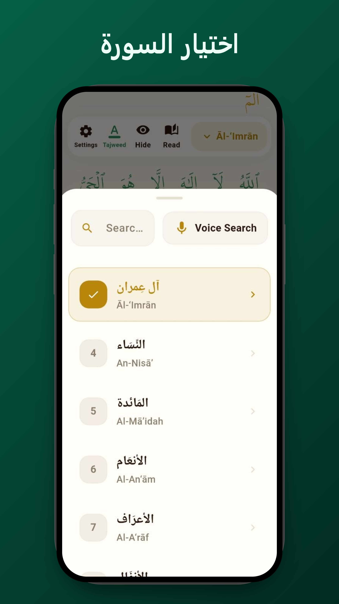
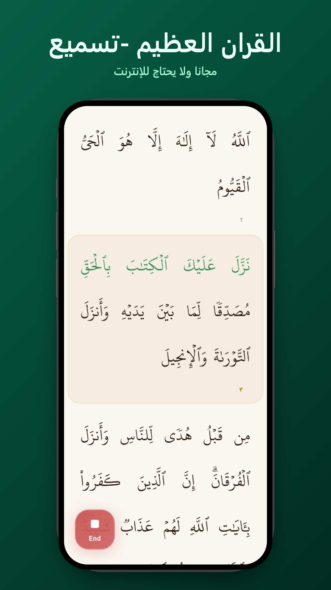
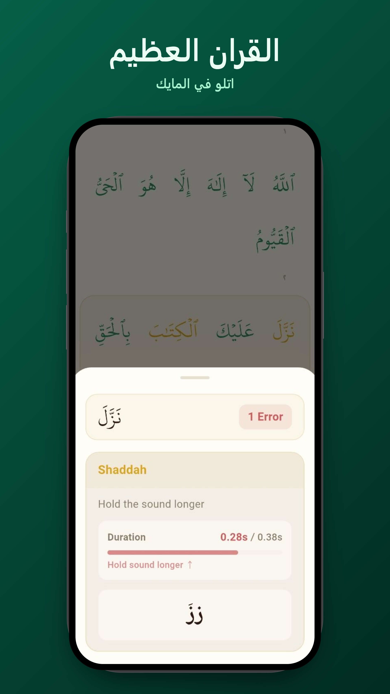
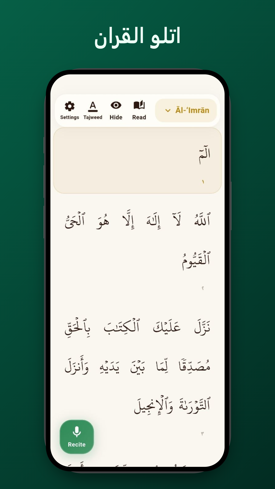
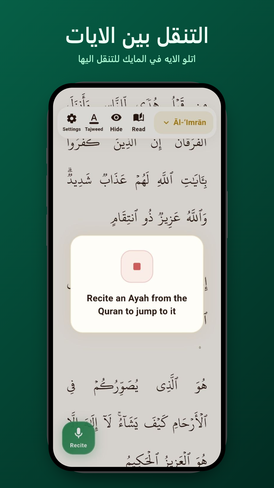

<div align="center">

# وما أَسأَلُكُم عَلَيهِ مِن أَجرٍ إِن أَجرِيَ إِلّا عَلىٰ رَبِّ العالَمينَ

<p align="center">
  <i>"And We have certainly made the Quran easy for remembrance, so is there any who will remember?"</i><br>
  <b>— Surah Al-Qamar (54:17)</b>
</p>


# Recite Quran — اتلو القران


<p align="center">
  
</p>

</div>

---
<p align="center">
  <a href="https://play.google.com/store/apps/details?id=com.recitequran.app" target="_blank">
    
  </a>
  &nbsp;&nbsp;
  <a href="https://recitequran.pages.dev/recite" target="_blank">
    
  </a>
  &nbsp;&nbsp;
  <a href="https://recitequran.pages.dev/" target="_blank">
    
  </a>
</p>
<br>

## Overview

**ReciteQuran** is an open-source, on-device AI assistant designed to listen to your Quran recitation in real time, guide your pronunciation word-by-word, and verify acoustic Tajweed durations with millisecond precision.

Unlike other applications that transmit your audio to remote servers, ReciteQuran runs an acoustic streaming neural network directly on your device. Your voice never leaves your phone, computer, or browser.

---

## Available Platforms

### Android

- **Google Play Store**: Install directly from [Google Play](https://play.google.com/store/apps/details?id=com.recitequran.app).
- **Direct APK**: Download pre-built APKs from the [Official Website](https://recitequran.pages.dev/).

---

### Web Browser

- Use ReciteQuran directly in any modern desktop or mobile browser without installing anything:
  👉 **[recitequran.pages.dev/recite](https://recitequran.pages.dev/recite)**

---

### iOS (iPhone & iPad)

- Download the IPA build artifact from the [GitHub Actions iOS Workflow](https://github.com/Iam-Muslim/ReciteQuran-ElhamduleAllah/actions/workflows/ios_build.yml) and install via AltStore, SideStore, or TrollStore, or deploy via Xcode.

---

### Windows (Desktop)

- ReciteQuran runs natively on Windows 10/11 (64-bit). You can run or build the desktop version directly from source using Flutter.

---

## Features

### 1. Real-Time Word Tracking
- High-speed acoustic tracking follows your speech word by word.
- **Visual Feedback**:
  - **Green**: Correct recitation (Consonants and Harakat match).
  - **Red**: Word skipped, substituted, or mispronounced.
  - **Yellow**: Tajweed Mistake . 

---

### 2. Acoustic Tajweed & Madd Engine
- Evaluates acoustic vowel holding durations against Quranic Tadweer timing standards:
  - **Madd Elongation (المدود)**:
    - Natural Madd (المد الطبيعي) — 2 Harakat
    - Separated / Connected Madd (المد المنفصل والمتصل) — 4 Harakat
    - Presented for Sukoon (المد العارض للسكون) — 2/4/6 Harakat
    - Leen Madd (مد اللين) — 2/4/6 Harakat
    - Compulsory Madd (المد اللازم) — 6 Harakat
  - **Mushaddad Ghunnah (غنة النون والميم المشددتين)** — 2 Harakat nasal hold.
  - **Shaddah Doubling (الشدة)** — Consonant closure duration (~1.5 Harakat).
- Tap any highlighted word to inspect expected versus recited duration in milliseconds.

---

### 3. Instant Voice Ayah Search
- The offline phonetic matcher locates the verse and jumps directly to it .
---

### 4. Hifz Memorization & Hide Mode
- Words reveal themselves as you recite them correctly.
---


## Developer Guide

### Repository Setup

1. Clone the repository:
   ```bash
   git clone https://github.com/Iam-Muslim/ReciteQuran-ElhamduleAllah.git
   cd ReciteQuran-ElhamduleAllah
   ```

2. Fetch Flutter packages:
   ```bash
   flutter pub get
   ```

3. Download the quantized ONNX neural model:
   ```bash
   pip install -U "huggingface_hub[cli]"
   hf download Quran-Lab/zipformer_p-arabic-v3 zipformer_p_arabic_v3.int8.onnx --local-dir assets/model
   ```

---

### Running on Android

```bash
flutter run -d android
flutter build apk --release --split-per-abi
```

---

### Running on iOS

```bash
cd ios
pod install
cd ..
flutter run -d ios
```

---

### Running on Windows

```bash
flutter run -d windows
```

---

### Running on Web

```bash
flutter run -d chrome
```

---

### Architecture

```
lib/
├── audio/                     # 16 kHz PCM chunk capture and buffering
│   └── audio_processor.dart
├── data/                      # Quranic text dataset and rule definitions
│   └── quran_data.dart
├── engine/                    # Streaming Zipformer inference in background Isolate
│   ├── models/                # Inter-isolate communication protocols
│   └── sherpa_engine.dart
├── state/                     # Global settings and theme management
│   └── app_state.dart
├── tracking/
│   ├── ayah_search/           # Offline phonetic verse search
│   ├── tajweed/               # Tajweed duration validator and explainer
│   │   ├── error_explainer.dart
│   │   └── tajweed_rules.dart
│   └── word/                  # Real-time phoneme alignment and highlight sequencing
│       ├── dictation_matcher.dart
│       ├── dictation_sequencer.dart
│       ├── highlighting_controller.dart
│       └── phoneme_alignment_isolate.dart
├── ui/                        # UI screens, dialogs, and Mushaf view
│   ├── tracking_screen.dart
│   └── widgets/
└── utils/                     # Logging and debug helpers
    └── debug_logger.dart
```

---

## (لوجه الله تعالى)

### **ما أسألكم عليه من أجر إن أجري إلا على رب العالمين**

> **THIS APPLICATION AND SOURCE CODE ARE FOR THE SAKE OF ALLAH ALONE.**

Before viewing, using, distributing, or modifying any part of this repository, you explicitly agree to the following sacred covenants:

1. **100% Free to End Users**:
   You may use, study, and redistribute this software or its logic **ONLY** in applications and services that are completely free of charge to all end users forever.
2. **Strict Prohibition on Commercialization & Profit**:
   You are **STRICTLY FORBIDDEN** from selling this application, placing it behind paywalls, subscription models, in-app purchases, charging download fees, monetizing it with advertisements (AdMob, Unity Ads, etc.), or extracting any financial revenue from this codebase, models, or outputs.
3. **Perpetual Waqf Pass-Through**:
   These terms are immutable and strictly pass on to any fork, derivative work, or redistributed component.

---

*Alhamdulillah (الحمد لله رب العالمين)* — This project builds on research and work from the following open-source projects:

- **[Zipformer Quran Streaming Model](https://huggingface.co/Quran-Lab/zipformer_p-arabic-v3)** by [Quran-Lab](https://huggingface.co/Quran-Lab) Brother - Mustafa 
- **[quran-transcript](https://github.com/OmarMuhammedAli/quran-transcript)** by [obadx](https://github.com/OmarMuhammedAli)
- **[Quranic Universal Aligner (qua_sdk)](https://huggingface.co/spaces/hetchyy/quranic-universal-aligner)** by [Hetchy](https://huggingface.co/hetchyy)

---

<div align="center">

**هذا من فضل ربي — ربنا تقبل منا إنك أنت السميع العليم**

</div>
